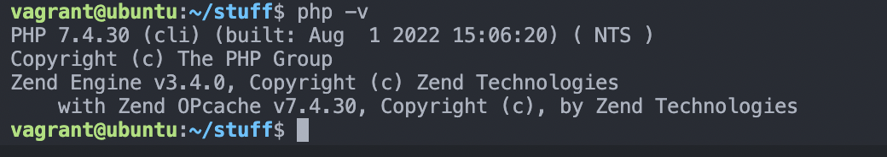
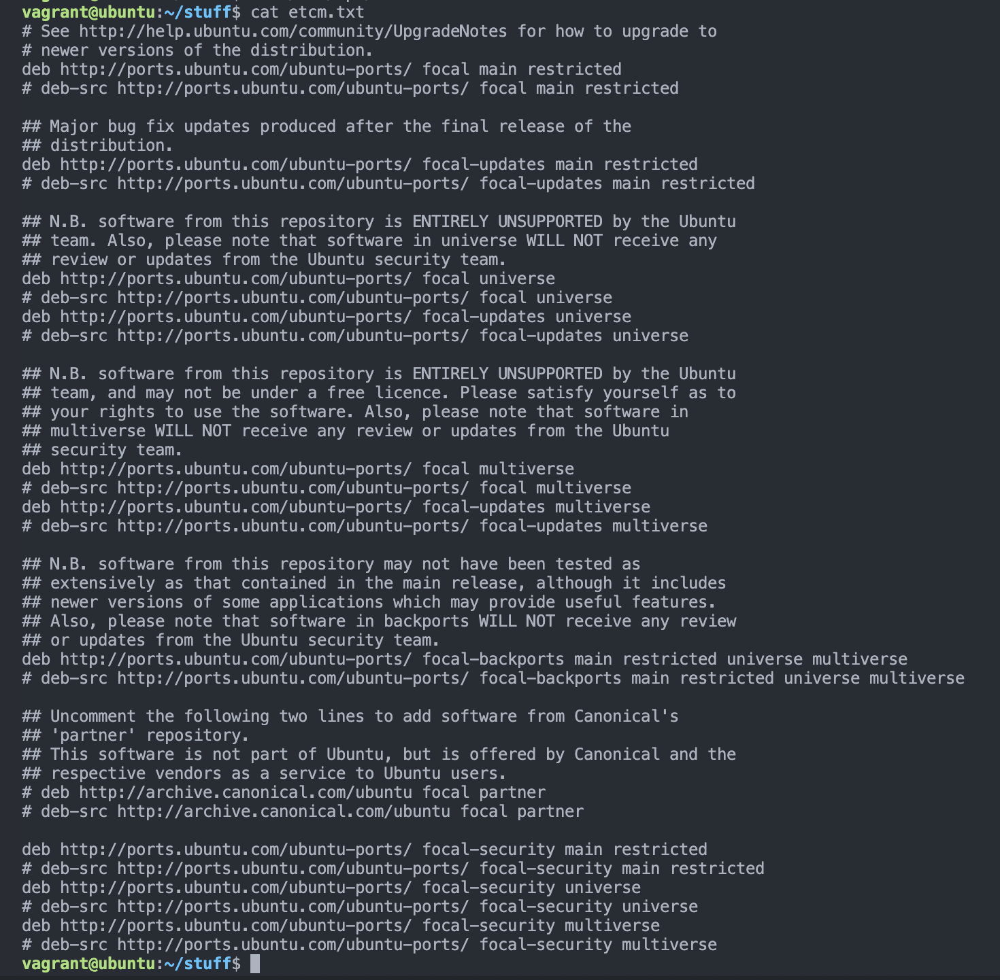

# Exercise-04

### Task
- Install PHP 7.4 on your local linux machine using the ppa:ondrej/php package repo.

### Instruction

- [ ] Learn how to use the add-apt-repository command
- [ ] Submit the content of `/etc/apt/sources.list` and the output of `php -v` command

### Procedure

##### Note-worthy Terms
- *add-apt-repository*: This is  a  script  which  adds  an  external  APT  repository  to   either
       /etc/apt/sources.list or a file in /etc/apt/sources.list.d/ or removes an already existing
       repository.
- *PHP*: PHP is a script language and interpreter that is freely available and used primarily on Linux Web servers.


Run the following command to update my package index

```
sudo apt update
```

Install `software-properties-commo` which adds management for additional software sources

```
sudo apt -y install software-properties-common
```

> The `-y` flag will automatically agree to the installation. Without that, there would be a prompt in the terminal window for each installation.


Next, install the repository ppa:ondrej/php, which will give you all your versions of PHP

```
sudo add-apt-repository ppa:ondrej/php
```

Finally, you update apt again so your package manager can see the newly listed packages

```
sudo apt update
```

Now you’re ready to install PHP 7.4 using the following command

```
sudo apt -y install php7.4
```

Run the next command to check the version of PHP installed

```
php -v
```

You will receive an output similar to the following




#### Contents of `/etc/apt/sources.list`


