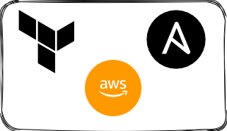
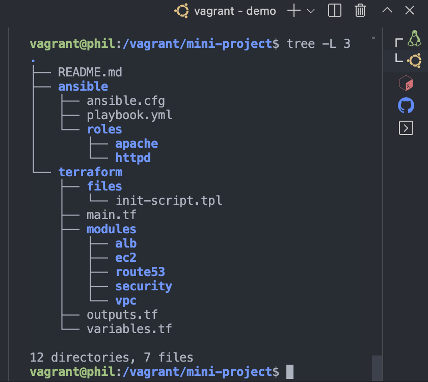
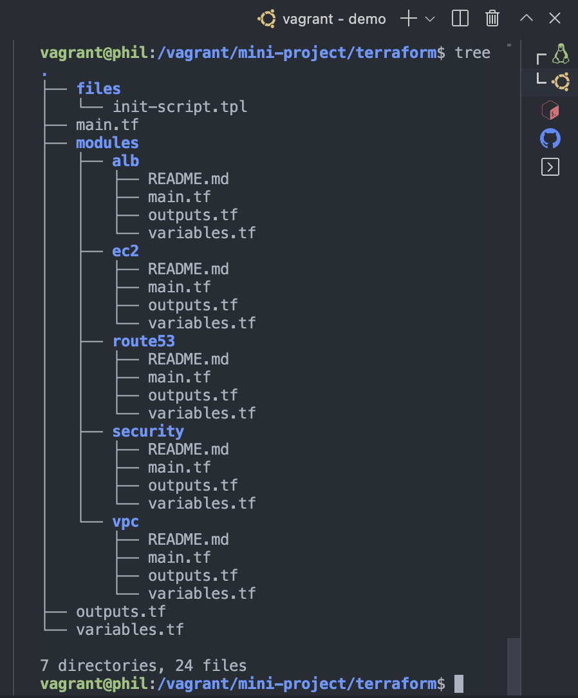
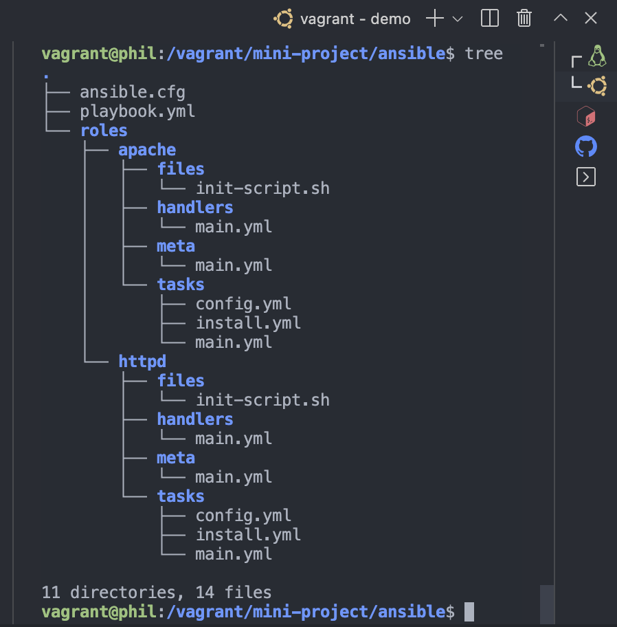

In this article, I will show you how to provision and a staeless web application using Terraform and Ansible

##### Terraform's configuration language is declarative, meaning that it describes the desired end-state for your infrastructure, in contrast to procedural programming languages that require step-by-step instructions to perform tasks. Terraform providers automatically calculate dependencies between resources to create or destroy them in the correct order.


* Prerequsites
To follow this article you will need:
  * The Terraform CLI installed
  * The AWS CLI installed
  * Git installed
  * AWS account and associated credentials that allow you to create resources
  * A key pair on AWS

 Note: I am also assuming you have basic to intermediate knowledge of AWS, Terraform and Ansible. If you don't you can checkout the following links to get you started.
 1. Intro to AWS
 2. What is Terraform
 3. Why use Ansible for automation

To use your IAM credentials to authenticate the Terraform AWS provider, set the `AWS_ACCESS_KEY_ID` and secret key environment variables by running the following commands, we'll be using this later.

```php
export AWS_ACCESS_KEY_ID=
```

```php
export AWS_SECRET_ACCESS_KEY=
```

_ Tip: <span> If you don't have access to IAM user credentials, use another authentication method described in the AWS provider documentation here . <span>

This tutorial will only provision resources that qualify under the <bold>AWS free tier<bold>. While following it please be sure that your AWS account qualifies for free tier resources, as I'll not responsible for any charges that you may incur.

## Write configuration
The set of files used to describe infrastructure in Terraform is known as a Terraform configuration.

## Best Practices
Before we get into laying out project structure, let’s talk about some of the basic Terraform development best practices first, so we can have a solid starting point.

## Project structure

First of all, don’t put everything in one file, you need to have a project folder structure for code reusability, code sharing, code maintenance, and code clarity. A typical Terraform folder structure will look like the following. Terraform has also made things easy for us by providing what we call Terraform modules, modules are basically reusable pieces of code just like functions or libraries.

By the end of this project, our terraform directory would look like the image below


###### Note: All files in your Terraform directory using the .tf file format will be automatically loaded during operations.

#### Use variables

Don’t hard code everything, even though you can totally do that, but it is recommended to define and store variables in a file called variables.tf . In my example, I have the following variables in my variables.tf 


Create a directory for your configuration.

 ```go
 variable "aws_region" {
  description = "region to deploy all aws project resources"
  type        = string
  default     = "us-east-1"
}

variable "instance_name" {
  description = "name prefix to assign to webserver instances"
  type        = string
  default     = "webserver-"
}
 ```

Change into the directory.

 ```php
 cd terraform-ansible
 ```


Create a main.tf file in your root directory, this file contains the cloud service provider information to define your infrastructure.

```go
touch main.tf
```

Open `main.tf` in your text editor, paste in the configuration below, and save the file.

```go
terraform {
  required_providers {
    aws = {
      source  = "hashicorp/aws"
      version = "~> 4.49.0"
    }
    local = {
      source = "hashicorp/local"
      version = "2.3.0"
    }
  }
  required_version = ">= 1.1.0"
}

/* this block configures the AWS provider */
provider "aws" {
  region = var.aws_region
}
```

For this project we will be perfoming the following tasks
1. Creating a VPC and all necessary components eg subnets, routes, gateways etc
2. Security groups (for ec2 instances & load balancer)
3. EC2 instances
4. Load balancer with target groups
5. Record in Route53

## VPC and components (Logical Network)
To create a VPC module, make sure your are in the project root directory, then create a sub-directory callled modules, this directory will house all modules used in this project.

 ```go
/* 
this block configures a (VPC) module, which provisions networking resources such as a VPC, subnets, and gateways
*/

module "vpc" {
  source  = "terraform-aws-modules/vpc/aws"
  version = "3.19.0"

  name = "${var.vpc_name}"
  cidr = var.cidr
  azs             = var.azs
  private_subnets = var.private_subnets
  private_subnet_names = var.private_subnets_names
  public_subnets  = var.public_subnets
  public_subnet_names = var.public_subnets_names
  enable_dns_hostnames = true
  enable_dns_support   = true

  tags = var.tags
}
 ```

## Security groups (for ec2 instances & load balancer)

```go
/* 
this block creates security groups for use with the instances and the load balancer
*/

module "webserver_security_group" {
  source      = "terraform-aws-modules/security-group/aws"
  version     = "4.17.1"
  name        = var.webserver_security_group_name
  description = "security group controlling traffic to webservers downstream the application load balancer"
  vpc_id              = var.vpc_id
  ingress_cidr_blocks = var.webserver_security_group_ingress_cidr
  ingress_rules       = var.webserver_security_group_ingress_rules
  egress_cidr_blocks  = var.security_group_egress_cidr
  egress_rules        = var.security_group_egress_rules
  egress_ipv6_cidr_blocks = []
}

module "alb_security_group" {
  source      = "terraform-aws-modules/security-group/aws"
  version     = "4.17.1"
  name        = var.alb_security_group_name
  description = "security group controlling traffic to application load balancer upstream the webservers"
  vpc_id              = var.vpc_id
  ingress_cidr_blocks = var.alb_security_group_ingress_cidr
  ingress_rules       = var.alb_security_group_ingress_rules
  egress_cidr_blocks  = var.security_group_egress_cidr
  egress_rules        = var.security_group_egress_rules
  egress_ipv6_cidr_blocks = []
}
```

## EC2 instances


```go
/* 
this block creates three similar EC2 instances and attaches a keypair
*/

module "ec2" {
  source  = "terraform-aws-modules/ec2-instance/aws"
  version = "4.3.0"

  ami                    = var.ami_id["amazon_linux_2_ami"]
  instance_type          = var.instance_type
  associate_public_ip_address = true
  user_data = file("./files/init-script.tpl")
  vpc_security_group_ids = var.vpc_security_group_ids
  putin_khuylo           = var.putin
  key_name               = var.key_name
  subnet_id              = var.subnet_id
  availability_zone      = var.availability_zone
  
  tags = var.tags
}
```
## Load balancer with targets

```go
module "alb" {
  source  = "terraform-aws-modules/alb/aws"
  version = "~> 8.0"

  name = var.alb_name

  load_balancer_type = "application"

  vpc_id             = var.vpc_id
  subnets            = var.subnets
  security_groups    = var.security_groups

  target_groups = [
    {
      name_prefix      = var.target_groups_name
      backend_protocol = "HTTP"
      backend_port     = 80
      target_type      = var.target_type
      targets = {
        target_01 = {
          target_id = var.target_01
          port = 80
        }
        target_02 = {
          target_id = var.target_02
          port = 80
        }
        target_03 = {
          target_id = var.target_03
          port = 80
        }
      }
    }
  ]

  https_listeners = [
    {
      port               = 443
      protocol           = "HTTPS"
      certificate_arn    = var.ssl_cert
      target_group_index = 0
    }
  ]

  http_tcp_listeners = [
    {
      port               = 80
      protocol           = "HTTP"
      target_group_index = 0
    }
  ]

  tags = {
    Environment = "Production"
  }
}
```

## Record in Route53

```go

data "aws_route53_zone" "zone" {
  zone_id      = var.zone_id
  private_zone = false
}

module "records" {
  source  = "terraform-aws-modules/route53/aws//modules/records"
  version = "~> 2.0"

  zone_id = data.aws_route53_zone.zone.zone_id
  records = var.records
}
```


Note: A hidden folder called .terraform will be generated, it contains all the plugins for your platform.

6. Run terraform fmt and terraform validate to reformat your code and run some basic validations.

7. Run terraform plan , this ........ It is a very convenient way to check whether the execution plan for a set of changes matches your expectations without making any changes to real resources or to the state.

8. Now we are ready to deploy! Simply run terraform apply and type yes


#### Possible errors you might encounter
![error image goes here]
Fix: 
   Change this: `ssh-22-tcp`
   To this: `ssh-tcp`


   EXTRAS

   

* Prerequsites
To deploy this project, you'll need:
  * The Terraform CLI installed
  * The AWS CLI installed
  * Git installed
  * AWS account and associated credentials that allow you to create resources
  * A key pair on AWS
  * An SSL public certificate on AWS

 Note: I am also assuming you have basic to intermediate knowledge of AWS, Terraform and Ansible.

To use your IAM credentials to authenticate the Terraform AWS provider, set the `AWS_ACCESS_KEY_ID` and secret key environment variables by running the following commands, we'll be using this later.

```php
export AWS_ACCESS_KEY_ID="insert your AWS ACCESS KEY here"
```

```php
export AWS_SECRET_ACCESS_KEY="insert your AWS SECRET KEY here"
```

Tip: <span> If you don't have access to IAM user credentials, use another authentication method described in the AWS provider documentation.</span>

Warning: This tutorial will only provision resources that qualify under the <bold>AWS free tier<bold>. While following it please be sure that your AWS account qualifies for free tier resources, as I'll not responsible for any charges that you may incur.

###### Note: 
  This prooject deploys automatically to the `us-east-1` region you can change this to whatever region is closer to you inorder to avoid latency issues.

### TO Deploy this project first 

Clone this repo

```php
git clone https://github.com/philemonnwanne/altschool-cloud-exercises.git
```


cd into the terraform directory and run terraform init

then run terraform plan to know what chnages will be made to your AWS

Deploy terraform config

```php
terraform apply -auto-approve
```

Note: Don't forget to run `terraform destroy` when you're done to clean up

## Main Project structure



## Terraform Directory structure



## Ansible Directory structure

