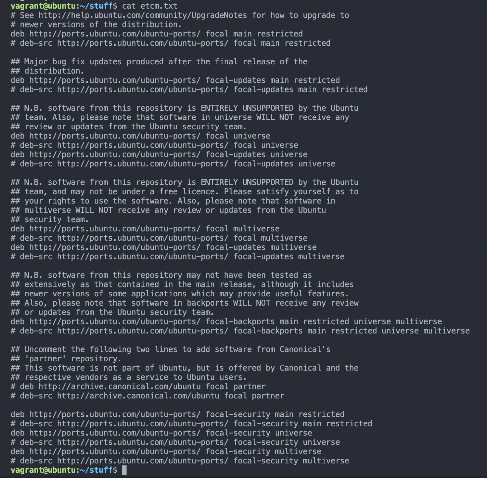

# Exercise-04

## Task: Install PHP 7.4 on your local linux machine using the ppa:ondrej/php package repo.

### Terms
-  add-apt-repository: This is  a  script  which  adds  an  external  APT  repository  to   either
       /etc/apt/sources.list or a file in /etc/apt/sources.list.d/ or removes an already existing
       repository.
- PHP 7

## Steps

- I ran the following command to update my package index

`sudo apt-get update`

- I install software-properties-common, which adds management for additional software sources:

`sudo apt -y install software-properties-common`

> The -y flag will automatically agree to the installation. Without that, you would receive a prompt in your terminal window for each installation.

- Next, I install the repository ppa:ondrej/php, which will give you all your versions of PHP:

`sudo add-apt-repository ppa:ondrej/php`

- I run the following command so my package manager can see the newly listed packages:

`sudo apt-get update`

- Then I install PHP 7.4 using the following command:

`sudo apt -y install php7.4`

- To check the version installed I run:

`php -v`

Which gives the below output:

Output

  

 

