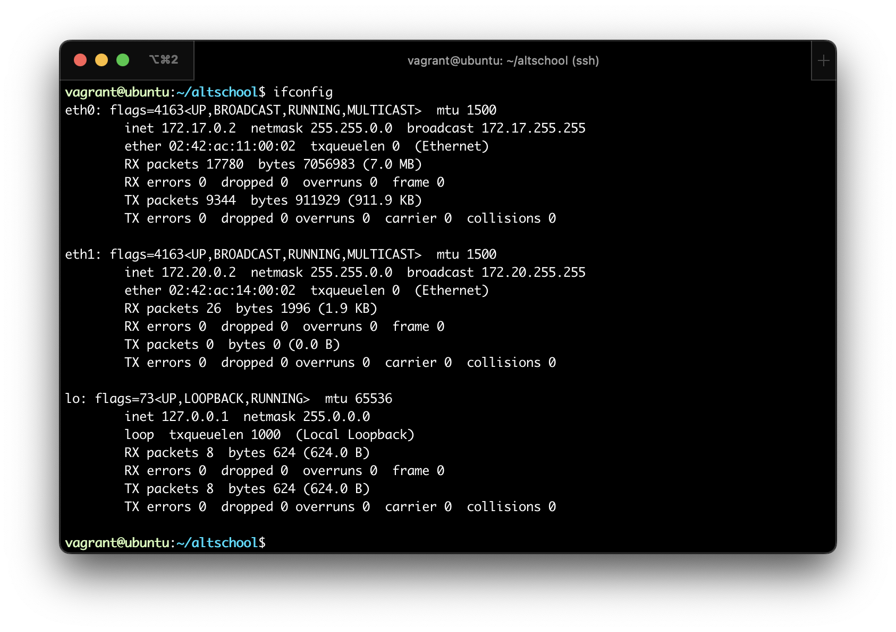

## Exercise-01

## Task: 
* Setup Ubuntu 20.04 LTS on your local machine using Vagrant

## Instruction: 
- [ ] Customize your Vagrant file as necessary with private_network set to DHCP.
- [ ] Once the machine is up, run ifconfig and share the output in your submission along with your Vagrant file in a folder for this exercise.
<br><br>

## Steps:

- I went over to vagrants website and downloaded the right version for my local machine (mac m1).
- I had to install docker as my vagrant provider since virtualbox doesn't provide support for m1 macbooks at the moment.

> After having both vagrant and docker running on my host machine, I proceeded to create my ubuntu os with the following steps:

- I created a directory for hosting my vagrant project
- I changed my working directory to the directory that I created earlier in the previous step
- I create an empty vagrantfile by running the `touch vagrantfile` command
- I proceed to configure my vagrantfile by setting private network to dhcp
- Then I provision my ubuntu virtual machine using the `vagrant up` command
- To login to my newly created linux virtual machine I issue the `vagrant ssh` command
- While in the virtual I install the `net-tools` package so as to be able to check my ip address
- By running the `ifconfig` command I am able to display my virtual machines IP address.
- To exit from my virtual machine to the host, I run the `exit` command
- Then to stop the virtual machine from running I issue the `vagrant halt` command

### Some other commands:

`vagrant status` - This will tell you the state of the machines Vagrant is managing.

`vagrant suspend` - This suspends the guest machine Vagrant is managing, rather than fully shutting it down or destroying it.

`vagrant destroy` - This command stops the virtual machine from running, and destroys all resources that were created for the machine.

`vagrant reload` - This is used to restart the virtual machine after making changes to the vagrantfile
<br><br>

## Output (ifconfig)


## Vagrantfile
```ruby
# -*- mode: ruby -*-
# vi: set ft=ruby :
Vagrant.configure("2") do |config|
  config.vm.hostname = "ubuntu"
  # Create a private network
  config.vm.network "private_network", type: "dhcp"
  # Provider-specific configuration so you can fine-tune various backing 
  # providers for Vagrant.
  # Custom configuration for docker
  config.vm.provider :docker do |docker|
    # this is where your Dockerfile lives
    docker.image = "philemonnwanne/vagrant-provider:20.04"
    # Make sure it sets up ssh with the Dockerfile Vagrant is pretty dependent on ssh
    docker.has_ssh = true
    # Configure Docker to allow access to more resources
    docker.privileged = true
    docker.volumes = ["/sys/fs/cgroup:/sys/fs/cgroup:rw"]
    docker.create_args = ["--cgroupns=host"]    
  end
  # View the documentation for the provider you are using for more
  # information on available options.
end
```
