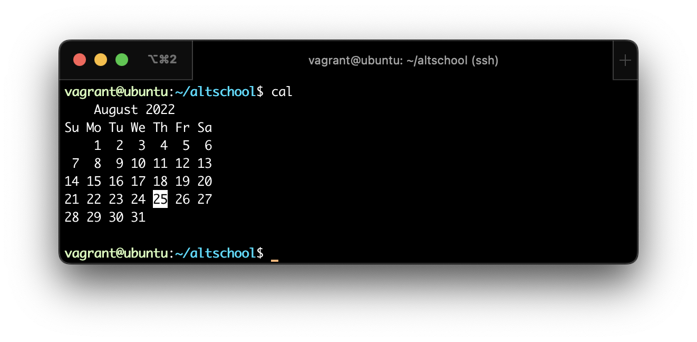
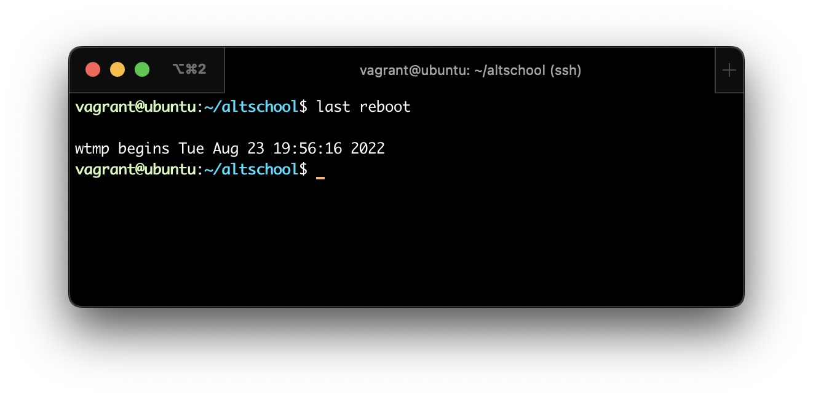
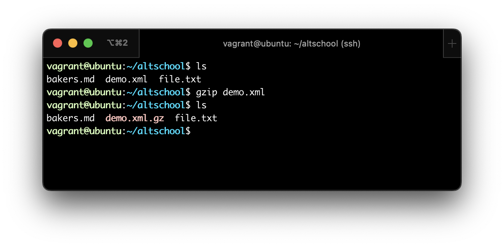
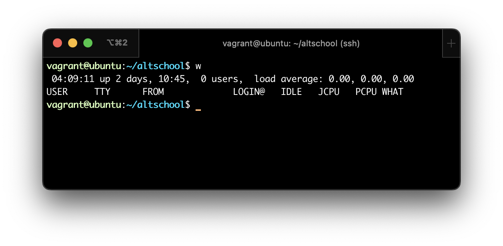
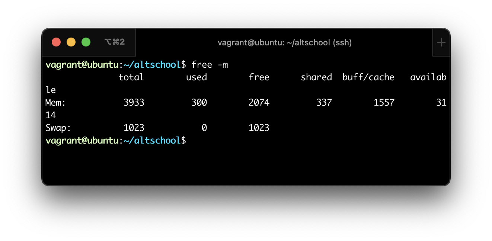
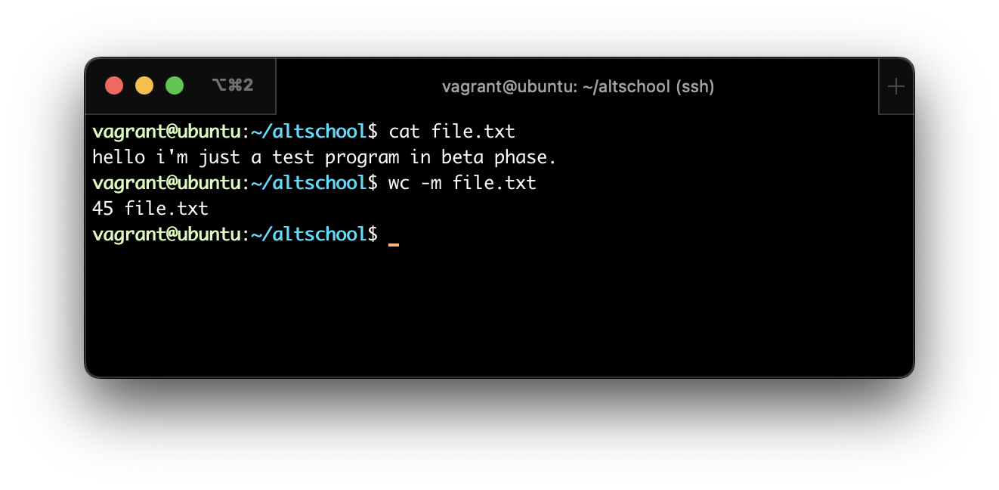
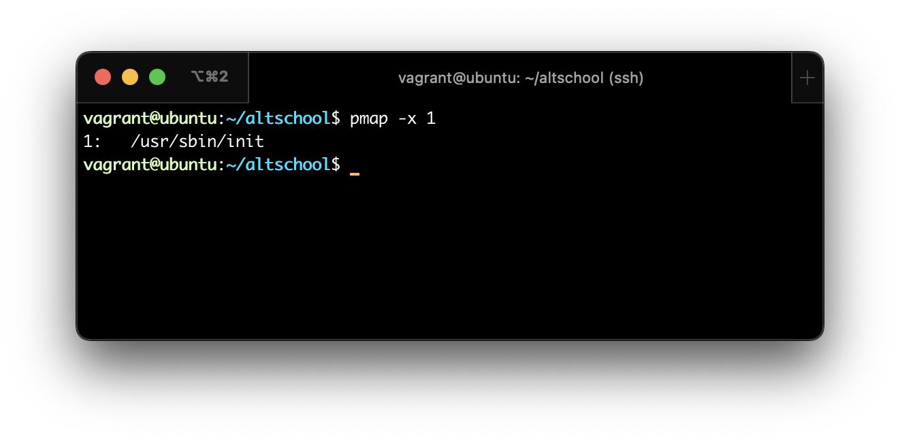
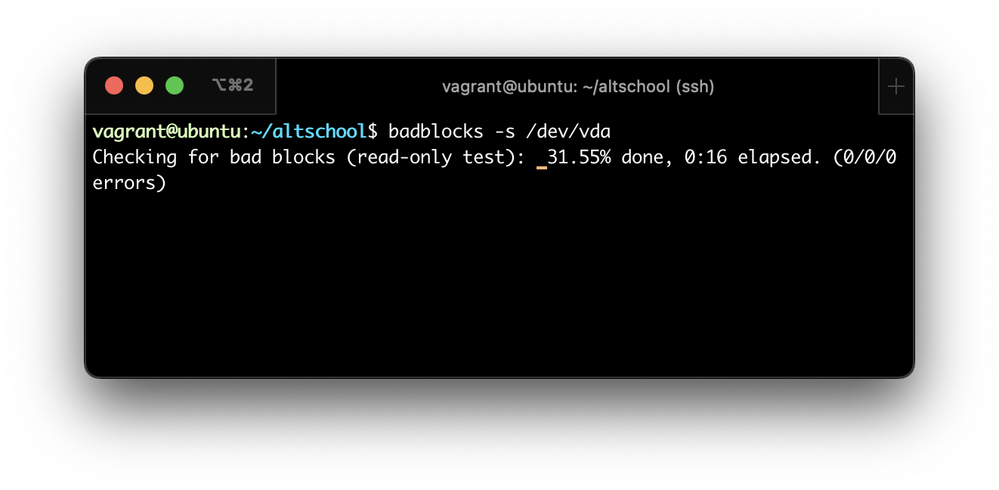
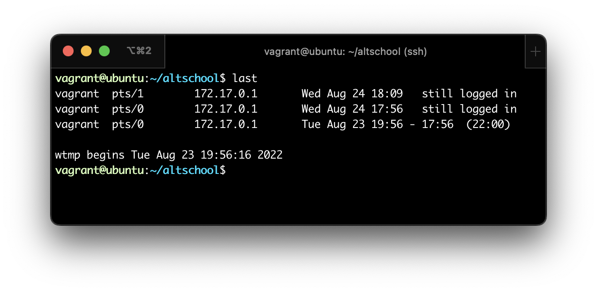
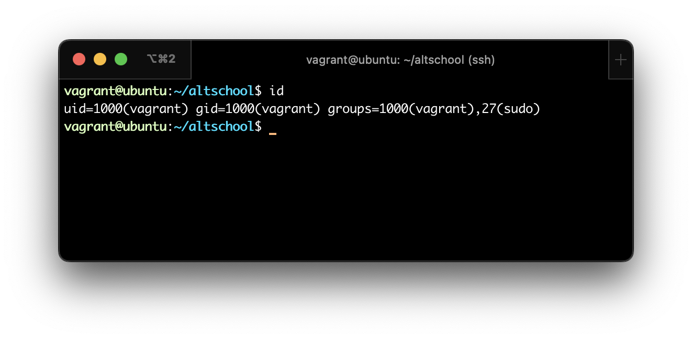

# Exercise-02

## Task: 
Research online for 10 more linux commands aside the ones already mentioned in this module. Submit using your altschool-cloud-exercises project, explaining what each command is used for with examples of how to use each and example screenshots of using each of them.

# 10 Linux Commands
 
 

1. `cal` - Displays a simple calendar

> 
 

2. `last reboot` - Shows system reboot history

> 
 

3. `gzip` - Used for compressing a file with .gz extension

> 
 

4. `w` - Displays currently logged in users in the system

> 
 

5. `free -m` - Displays free and used memory in the system (-m flag indicates memory in MB)

> 
 

6. `wc` - Prints the number of bytes, words and lines in a file

> 
 

7. `pmap` - Displays memory map of processes

> 
 

8. `badblocks` - Used to test for unreadable blocks on disk

> 
 

9. `last` - Shows the last logins in the system

> 
 

10. `id` - Displays the details of the active user e.g. uid, gid, and groups

> 

