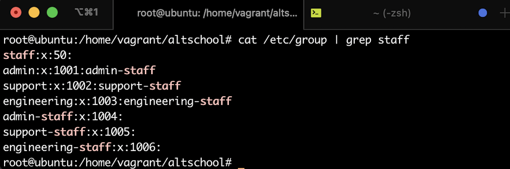
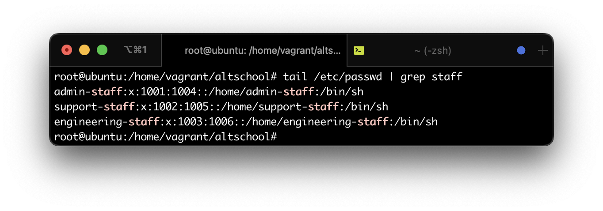
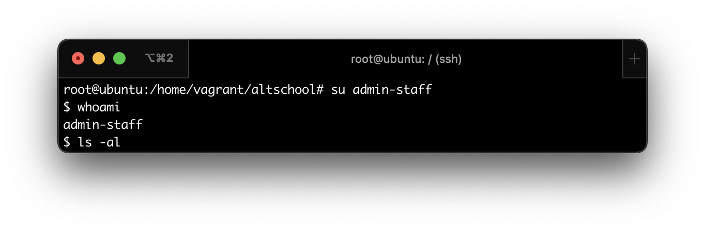
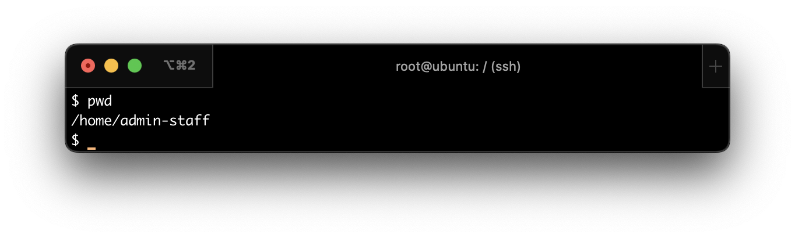
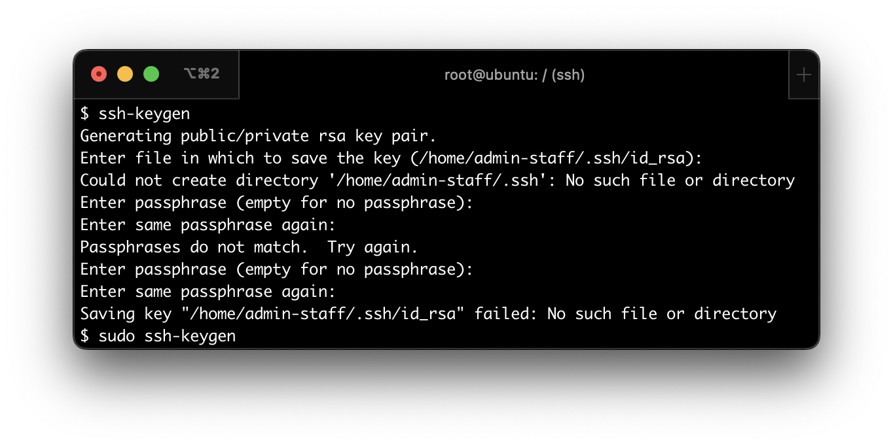

# Exercise-03

## TASK 1: Create 3 groups - admin, support and engineering and add the admin group to sudoers.

### To carry out this task I took the following steps;
- Logged into my ubuntu virtual machine
- Gained root user privilage by running the command `sudo su` which grants me administrative rights
- To create the groups I ran the following commands:

`groupadd admin` -- Creates the `admin` group 

`groupadd support` -- Creates the `support` group 

`groupadd engineering` -- Creates the  `engineering` group 

To confirm that the groups were created successfully, I ran the following command:`tail /etc/group | grep staff`

<samp>What this command does is to display the end of a file. By default, this command selects the last 10 lines of the file and displays them, in this case the `etc/group file`. And the grep command searches the file for the argument passed after it and fetches every occurence of that argument in this case `staff`</samp>  

  

 

## TASK 2: Create a user in each of the groups

### To carry out this task I took the following steps;
> While still logged in as the root user

To create the groups I ran the following commands:

`groupadd admin` -- Creates the group admin

`groupadd support` -- Creates the group support

`groupadd engineering` -- Creates the group engineering

To confirm that the users were created successfully, I ran the following command:

`tail /etc/passwd | grep staff`  -- See command output below

<samp>What this command does is to display the end of a file. By default, this command selects the last 10 lines of the file and displays them, in this case the `etc/passwd file`. And the grep command searches the file for the argument passed after it and fetches every occurence of that argument in this case `staff`</samp>

  

## TASK 3: Generate SSH keys for the user in the admin group

### To carry out this task I took the following steps;

- Switched from `root` to the admin-user `(admin-staff)` using the command `sudo su`
- I tried to confirm if I was the current user by running the command:

`whoami` -- To confirm the current logged in user (the user in the admin group.)

  

`pwd` -- To confirm my present working directory

  

`ssh-keygen` -- To generate SSH keys for the user in the admin group

> Note: This gave me an error message which was as a result of the user being created via the `useradd` command, as this creates just a user without a home profile. Another alternativer was to create the user with the `adduser` or `user -m` command.

  

To fix the error, I ran the followoing commands:

`mkdir /home/admin-staff` --To create the directory /home/admin-staff

`ls /home` -- To confirm that the directory was created

`cp -rT /etc/skel /home/admin-staff` -- To populate /home/admin-staff with default files and folders

`ls -al /home/admin-staff` -- To confirm presence of the default files and folders

`chown -R admin-staff:admin-staff /home/admin-staff` -- To change the owner of /home/admin-staff to user admin-staff

`su admin-staff` -- To switch user back to admin-staff

`cd home/admin-staff` -- To navigate to the home directory of `admin-staff`

`whoami` -- To confirm the current logged in user

`pwd` -- To confirm my present working directory

`ssh-keygen` -- To generate SSH keys for the logged in user

